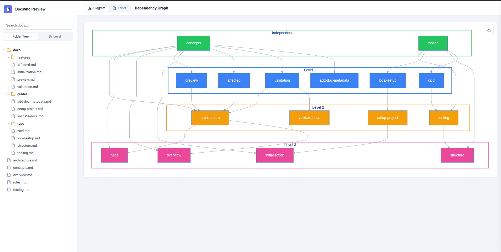

# doctrace

Trace documentation dependencies in large codebases. When code changes, know exactly which docs need review - and in what order.

Add metadata hints to your docs, and doctrace builds a dependency graph that maps code→docs and docs→docs relationships. AI agents use these hints to know exactly what to read when validating or updating documentation.

```
  src/booking/handler.ts changed
              │
              v
  ┌───────────────────────────────────┐
  │ doctrace affected docs/ --last 1  │
  └───────────────────────────────────┘
              │
              v
  ┌───────────────────────────────────┐
  │ Direct hits:                      │
  │   docs/bookings.md                │  ← has "related sources: src/booking/"
  │                                   │
  │ Indirect hits:                    │
  │   docs/payments.md                │  ← referenced BY docs/bookings.md
  └───────────────────────────────────┘
```

<div align="center">
<details>
<summary>How it works</summary>
<div align="left">

Each doc ends with metadata sections:

```markdown
# Booking System

How bookings work...

---

related docs:
- docs/payments.md - payment integration

related sources:
- src/booking/           - booking module
- src/booking/commands/  - command handlers
```

When `src/booking/handler.ts` changes:

```
doctrace affected docs/ --last 1

Direct hits (1):
  docs/bookings.md       <- references src/booking/

Indirect hits (1):
  docs/payments.md       <- referenced BY docs/bookings.md
```

The propagation: if `bookings.md` might be outdated, then `payments.md` (which references it) might also need review.

</div>
</details>
</div>

<div align="center">
<details>
<summary>Interactive preview explorer</summary>
<div align="left">

<figure>
  
  <figcaption>Interactive panel to visualize dependencies between docs, edit content, and explore git history.</figcaption>
</figure>

</div>
</details>
</div>

## Features

- info     - shows doc phases and validates refs
- affected - finds docs affected by code changes (with dependency ordering)
- preview  - interactive docs explorer in browser
- base     - manages base commit for incremental analysis

## Motivation

In large codebases, docs get outdated because:
1. No one remembers which docs need updating when a file changes
2. AI agents don't know which files to read to understand each doc

doctrace solves this by adding "hints" to each doc - `related sources:` tells any AI exactly what to read.

## Quickstart

### 1. Install

```bash
pipx install doctrace
```

### 2. Add metadata to your docs

<div align="center">
<details>
<summary>Custom style (default) - metadata at bottom</summary>
<div align="left">

```markdown
# My Feature

Documentation content here...

---

related docs:
- docs/other-feature.md - brief description

related sources:
- src/feature/           - main module
- src/feature/utils.ts   - helper functions
```

</div>
</details>
</div>

<div align="center">
<details>
<summary>Frontmatter style - metadata at top</summary>
<div align="left">

```markdown
---
related docs:
  - docs/other-feature.md - brief description

related sources:
  - src/feature/         - main module
  - src/feature/utils.ts - helper functions
---

# My Feature

Documentation content here...
```

Config required:
```json
{
  "metadata": {
    "style": "frontmatter"
  }
}
```

</div>
</details>
</div>

### 3. Initialize config (optional)

```bash
doctrace init    # creates .doctrace/ folder
```

<div align="center">
<details>
<summary>Config options</summary>
<div align="left">

doctrace.json (at repo root):
```json
{
  "metadata": {
    "required_docs_key": "required_docs",
    "related_docs_key": "related_docs",
    "sources_key": "sources"
  },
  "base": {
    "commit_hash": "abc123...",
    "commit_message": "feat: something",
    "commit_date": "2026-02-17T10:30:00+00:00",
    "analyzed_at": "2026-02-17T20:55:32+00:00"
  }
}
```

options:
- `metadata.required_docs_key`: frontmatter key for required docs (default: "required_docs")
- `metadata.related_docs_key`:  frontmatter key for related docs (default: "related_docs")
- `metadata.sources_key`:       frontmatter key for source refs (default: "sources")
- `base`:                       set by `doctrace base update`

</div>
</details>
</div>

### 4. Use it

```bash
doctrace info docs/                         # show phases + validate refs
doctrace affected docs/ --last 5            # find docs affected by last 5 commits
doctrace affected docs/ --since v1.0.0      # find docs affected since tag/commit/branch
doctrace preview docs/                      # interactive explorer in browser
```

<div align="center">
<details>
<summary>All commands</summary>
<div align="left">

| Command                                          | Description                          |
|--------------------------------------------------|--------------------------------------|
| `doctrace info <path>`                           | show phases + validate refs          |
| `doctrace affected <path> --last <N>`            | list affected docs by last N commits |
| `doctrace affected <path> --since <ref>`         | list affected docs since ref         |
| `doctrace affected <path> --since-base`          | list affected docs since base commit |
| `doctrace affected <path> --base-branch <branch>`| list affected docs from merge-base   |
| `doctrace affected <path> --verbose`             | show changed files and match details |
| `doctrace affected <path> --json`                | output as JSON                       |
| `doctrace preview <path>`                        | interactive explorer in browser      |
| `doctrace preview <path> --port <N>`             | preview on custom port (default 8420)|
| `doctrace base update`                           | save current commit as base          |
| `doctrace base show`                             | show base state                      |
| `doctrace init`                                  | create .doctrace/ folder             |
| `doctrace --version`                             | show version                         |

</div>
</details>
</div>

<div align="center">
<details>
<summary>Example output</summary>
<div align="left">

```
Direct hits (3):
  docs/concepts.md
  docs/api.md
  docs/utils.md

Indirect hits (1):
  docs/overview.md <- docs/api.md

Phases (3):
  1. docs/concepts.md, docs/utils.md
  2. docs/api.md
  3. docs/overview.md
```

Phases show dependency order - useful for AI agents processing docs.

</div>
</details>
</div>

## Development

```bash
make install           # create venv + install
make check             # lint
make test              # run tests
doctrace info docs/    # practical test
```

```bash
# dev alias (doctraced)
ln -s $(pwd)/.venv/bin/doctrace ~/.local/bin/doctraced   # install
rm ~/.local/bin/doctraced                                # remove
```
